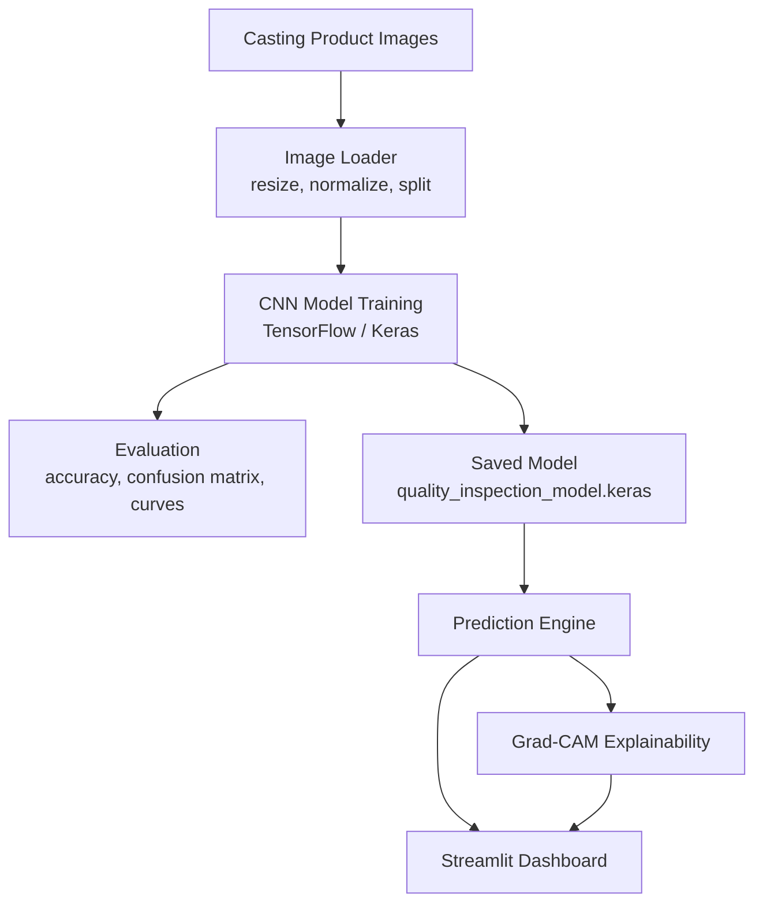

# Computer Vision Product Quality Inspection System

**Live Application:** [Open Streamlit App](https://computer-vision-quality-inspection-qkv9autqvpnjyoz5tzn8n3.streamlit.app/)

**GitHub Repository:** [praveenraj9623-sketch/computer-vision-quality-inspection](https://github.com/praveenraj9623-sketch/computer-vision-quality-inspection)

> A computer vision quality inspection system that classifies industrial casting images as defective or acceptable, supported by model evaluation, Grad-CAM explainability, and an interactive Streamlit dashboard.

**[Open Live App ->](https://computer-vision-quality-inspection-qkv9autqvpnjyoz5tzn8n3.streamlit.app/)**

[](https://python.org)
[](https://tensorflow.org)
[](https://opencv.org)
[](https://streamlit.io)
[](https://computer-vision-quality-inspection-qkv9autqvpnjyoz5tzn8n3.streamlit.app/)

[](https://praveenraj9623-sketch.github.io/)
[](https://github.com/praveenraj9623-sketch/computer-vision-quality-inspection)

---

## What is This Project?

This project demonstrates an end-to-end visual quality inspection workflow for industrial product images. It trains a CNN-based classifier, evaluates model performance, generates explainability outputs, and provides a dashboard where users can upload images for defect prediction.

**Core outcome:** product image -> preprocessing -> CNN inference -> defect / ok prediction -> Grad-CAM explanation -> dashboard decision support.

---

## Dataset

The project is built around the public casting product quality dataset:

[Real-Life Industrial Dataset of Casting Product](https://www.kaggle.com/datasets/ravirajsinh45/real-life-industrial-dataset-of-casting-product)

---

## System Architecture



---

## Tech Stack

| Category | Tools & Libraries |
|---|---|
| Language | Python |
| Deep Learning | TensorFlow, Keras |
| Computer Vision | OpenCV, Pillow |
| Data Processing | NumPy, Pandas |
| ML Utilities | scikit-learn |
| Visualization | Matplotlib, Plotly |
| App Layer | Streamlit |

---

## Module Details

| Module | Purpose |
|---|---|
| `train.py` | Trains the image classification model |
| `evaluate.py` | Evaluates model outputs and metrics |
| `src/model_builder.py` | Defines the CNN architecture |
| `src/data_utils.py` | Loads and prepares image datasets |
| `src/predictor.py` | Runs image inference |
| `src/gradcam.py` | Produces Grad-CAM visual explanations |
| `src/reporting.py` | Creates model reporting outputs |
| `app.py` | Streamlit dashboard |

---

## Dashboard Pages

- Overview of the quality inspection problem
- Image upload and defect prediction
- Model details and training configuration
- Evaluation results
- Grad-CAM explainability view

---

## Quick Start

```bash
git clone https://github.com/praveenraj9623-sketch/computer-vision-quality-inspection.git
cd computer-vision-quality-inspection
python -m venv .venv
.venv\Scripts\activate
pip install -r requirements.txt
streamlit run app.py
```

The local dashboard opens at:

```text
http://localhost:8501
```

---

## Training and Evaluation

```bash
python train.py
python evaluate.py
```

The trained model is expected at:

```text
models/quality_inspection_model.keras
```

---

## Project Structure

```text
computer-vision-quality-inspection/
|-- app.py
|-- train.py
|-- evaluate.py
|-- requirements.txt
|-- runtime.txt
|-- models/
|-- outputs/
|-- screenshots/
`-- src/
    |-- config.py
    |-- data_utils.py
    |-- gradcam.py
    |-- model_builder.py
    |-- predictor.py
    |-- reporting.py
    `-- visualization.py
```

---

## Limitations

- Model behavior depends on the quality and coverage of casting image data.
- Industrial deployment would require camera calibration, production validation, and monitoring.
- Grad-CAM highlights influential image regions but does not prove root cause.

---

## Future Improvements

- Add batch image inspection.
- Add model drift tracking for new production images.
- Add object detection or segmentation for defect localization.
- Add FastAPI endpoint for factory-line integration.

---

## Author

Built by **Praveen Raj A**

- LinkedIn: https://www.linkedin.com/in/praveen-raj-a-b05abb2a3/
- GitHub: https://github.com/praveenraj9623-sketch
- Repository: https://github.com/praveenraj9623-sketch/computer-vision-quality-inspection
- Live App: https://computer-vision-quality-inspection-qkv9autqvpnjyoz5tzn8n3.streamlit.app/
